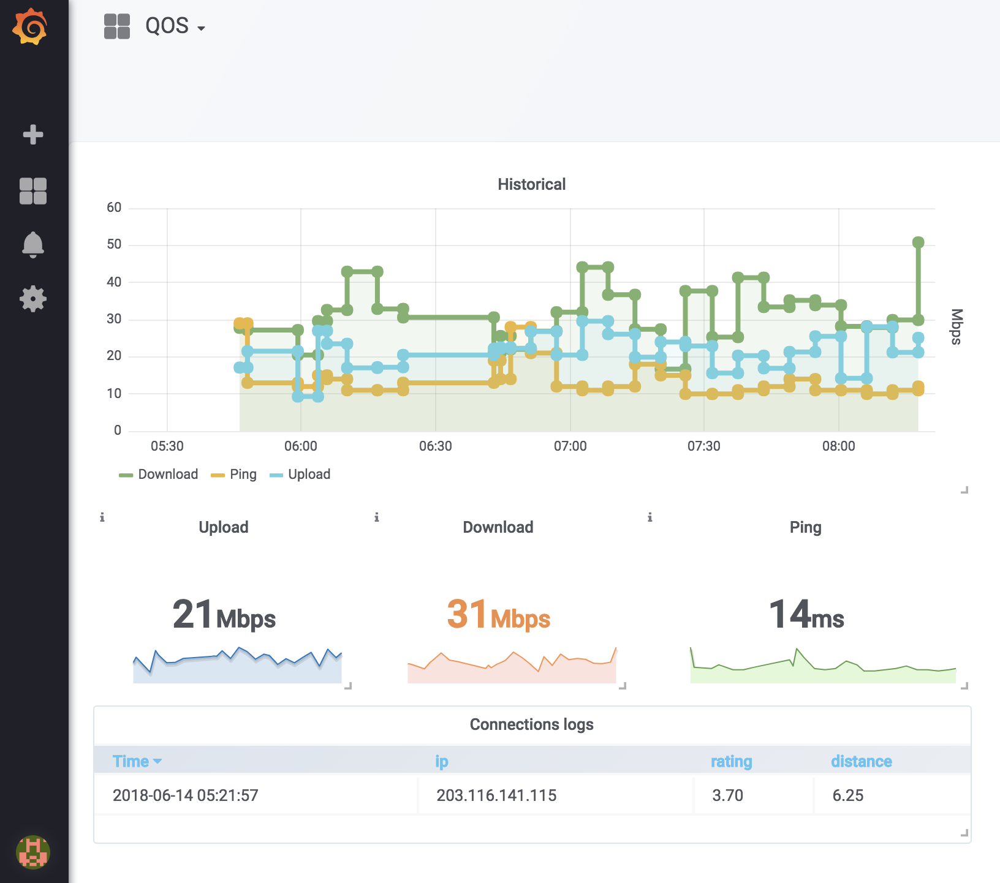

# Network QOS Monitoring

> Test and monitor your internet connection speed and ping using
>	[speedtest.net](http://www.speedtest.net) from the CLI




## Install

Ensure you have Node.js version 0.10 or higher installed, as well as
docker. Then run the following:

```
$ npm install

$ # start and configure database and dashboard
$ ./init.d/bootstrap.sh
```

Then import `./init.d/qos-dashboard.json` in [the import panel](http://localhost:3000/dashboard/import).

Finally start monitoring `./monitor.sh`.


## Usage

```
$ ./cli --help

  Test your internet connection speed and ping using speedtest.net from the CLI

  Usage
    $ speed-test

  Options
    --bytes -b    Output the result in megabytes per second (MBps)
    --verbose -v  Output more detailed information
    --db-host -h  Database host

```

## DB Cli

Connect to Influx using `docker-compose exec db influx`. Then:

```sql
InfluxDB shell version: 1.8.10
> SHOW DATABASES;
name: databases
name
----
network
_internal

> USE network
> SHOW MEASUREMENTS
> SELECT download, upload, ping, location FROM qos
```


## License

MIT © [Xavier Bruhiere](http://xav-b.fr)
